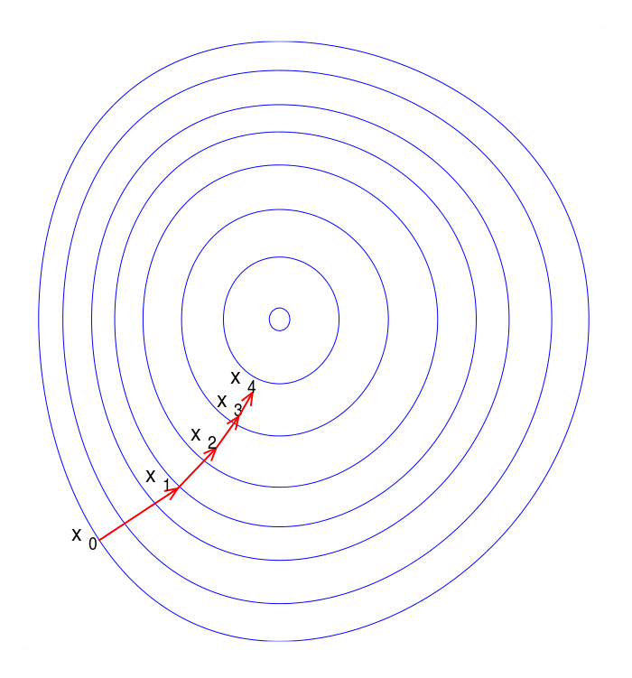

slidenumbers: true
autoscale: true

# **CloudFormation  Custom Resource Providers**

## Beyond AWS Native Resource Types


[.footer: by Ruben de Gooijer]

---

# Agenda

1. Problem
2. Solution
3. Addition Reinvented
4. Conclusion
5. Q&A

---

# Infrastructure As Code

Declare the desired state of your infrastructure, and CloudFormation does the rest:

- Change detection
- Reconcile current state with desired state
- Dependency management
- Handle intermittent failures
- Throttling of API calls
- ...


---

# What about non-AWS resources?

- **Third-parties**
  - DataDog, Selenium, ...
- **Internal APIs**
  - Admin user, service configuration, ...
- **Features not supported by native resource types**
  - More advanced secret generation, helper functions, ...
- **Use of external data sources**
  - Readonly configuration hosted elsewhere, ...

<!--  -->


<!-- [.footer: Image by [jeferrb](https://pixabay.com/users/jeferrb-590530)] -->

---

# Mechanisms

There are two extension mechanisms for CloudFormation:

- **Custom Resource Providers**
- **Resource Types**

The key difference is the level of integration with CloudFormation.

---


---

```javascript


function AddFn(A, B) {
  return A + B;
}

AdditionResultResource 
  = AddFn(2, 2);
```

---


---


---

[.column]

```yaml
AddFn:
    Type: AWS::Lambda::Function
    Properties:
      Handler: index.lambda_handler
      Runtime: python3.8
      Code:
        ZipFile: | See right

AdditionResultResource:
    Type: Custom::Add
    Properties:
      ServiceToken: !GetAtt "AddFn.Arn"
      A: 2
      B: 2

Outputs:
  AdditionResult:
    Description: "Result of Addition"
    Value: !GetAtt AdditionResultResource.Result
```

[.column]

```python
import cfnresponse, uuid

def lambda_handler(event, context):
  response_data = {}
  if event["RequestType"] == "Create":
    a = int(event["ResourceProperties"]["A"])
    b = int(event["ResourceProperties"]["B"])
    physicalResourceId = uuid.uuid4()
    response_data = { "Result": a + b }
  
  else: # "Update" or "Delete":
    physicalResourceId = event["PhysicalResourceId"]

  cfnresponse.send(
    event, 
    context, 
    cfnresponse.SUCCESS, 
    response_data, 
    physicalResourceId
  )
```

^ only executed once, acts like a cached function

---

# [Idempotency](https://docs.aws.amazon.com/cloudformation-cli/latest/userguide/resource-type-test-contract.html)

Create handler **MUST** be idempotent:

```
create(data) = create(create(data)) = create(create(create(data)))
```

Otherwise it will leak resources in the non-happy case 
when resource creation is retried.

[.footer: Idempotency RFC: https://tools.ietf.org/html/draft-idempotency-header-00]

---

# [Stabilization Properties](https://docs.aws.amazon.com/cloudformation-cli/latest/userguide/resource-type-test-contract.html#resource-type-test-contract-additional-stabilization%23resource-type-test-contract-additional-stabilization)

- **Desired-state stabilization**
  - After a Create/Update, subsequent calls **MUST** be able to **read** the properties
- **Runtime-state stabilization**
  - After a Create/Update, subsequent calls **SHOULD** be able to **use** the resource

For simple resources stabilization can be immediate.

Not *always* the case - for example, [when creating EC2 instances](https://docs.aws.amazon.com/AWSEC2/latest/APIReference/query-api-troubleshooting.html#eventual-consistency).



[.footer: Image: https://en.wikipedia.org/wiki/Gradient_descent]

---

# Frameworks / Libraries

Ease implementation with helper library for handling common concerns.

|                      | Binx.io [cfn-resource-provider](https://github.com/binxio/cfn-resource-provider)  | AWS [custom-resource-helper](https://github.com/aws-cloudformation/custom-resource-helper) |
| ---------------------| --------------------------|---------------|
| Schema validation    | Yes (json schema)                    | -
| Error handling       | Yes                                  | Yes
| Lifecycle hooks      | Yes                                  | Yes
| Language             | Python                               | Python (typed)
| Logging              | Basic                                | Basic + Context
| Long running provisioning (+15min)              | -                               | Yes (CloudWatch Events)

---

# Custom Resource Provider or Resource Type

|                      | Custom Resource Provider  | Resource Type |
| ---------------------| --------------------------|---------------|
| Schema               | Internal                  | External
| Execution            | Own Account               | AWS Managed
| Pricing              | Underlying Resources      | Per handler op*
| Namespace            | `Custom::*`               | All Non-Reserved
| Testing Framework    | No                        | Yes
| Conformance Testing  | -                         | Yes
| Language Support     | Any                       | Java, Go, Python
| Distribution         | Copy Template             | CFN Registry (public/private)

[.footer: \* https://aws.amazon.com/cloudformation/pricing/]

---

# What Others Are Doing

- [Terraform custom providers](https://www.terraform.io/docs/plugins/provider.html)
- [Kubernetes custom resources](https://kubernetes.io/docs/concepts/extend-kubernetes/api-extension/custom-resources/)
- [Azure custom resource provider](https://docs.microsoft.com/en-us/azure/azure-resource-manager/custom-providers/tutorial-custom-providers-create)

---

# Conclusion

- Quite easy to write; even easier with helper framework / library
- Be careful with secrets, use `NoEcho` option
- Cost/benefit of explicitly modelling Custom Resource Provider API
- When are custom resources not a good fit?
- **Resource Types** the future?

---

# Q&A


[.footer: Image by [Robin Higgins](https://pixabay.com/nl/users/robinhiggins-1321953)]

